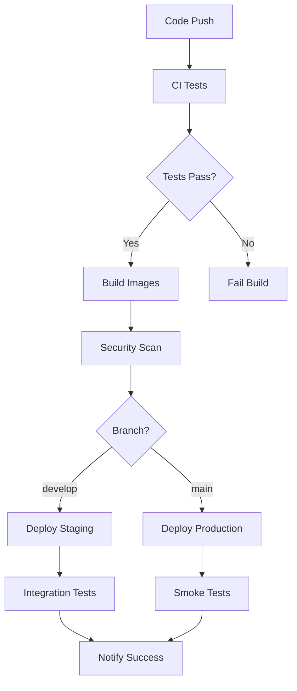

# 🔄 CI/CD Pipeline Documentation

> **Automated testing, building, and deployment for the ADK Multi-Agent System**

## 🏗️ Pipeline Overview

Our CI/CD pipeline provides comprehensive automation for:
- **Continuous Integration**: Code quality, testing, security scanning
- **Continuous Deployment**: Automated deployment to staging and production
- **Multi-environment support**: Staging and production environments
- **Docker containerization**: Consistent deployment across environments

## 🔄 Workflow Triggers

### Automatic Triggers
- **Push to `main`**: Triggers production deployment
- **Push to `develop`**: Triggers staging deployment
- **Pull Request to `main`**: Runs CI tests only

### Manual Triggers
- **Workflow Dispatch**: Manual deployment to staging or production
- **Environment Selection**: Choose target environment via GitHub UI

## 🧪 CI Pipeline Stages

### 1. **Lint & Test** 🧪
```yaml
- Code formatting check (Black, isort)
- Linting with flake8
- Type checking with mypy
- Unit tests with pytest
- A2A Protocol compliance tests
```

### 2. **Security Scan** 🔒
```yaml
- Dependency vulnerability scanning
- Secret detection with TruffleHog
- Security policy compliance
```

### 3. **Build Docker Images** 🏗️
```yaml
- Multi-agent Docker builds
- Image security scanning
- Container testing
- Push to Google Container Registry
```

## 🚀 CD Pipeline Stages

### Staging Deployment
- **Trigger**: Push to `develop` branch
- **Environment**: `staging`
- **Resources**: Minimal (cost-optimized)
- **Testing**: Integration tests

### Production Deployment
- **Trigger**: Push to `main` branch
- **Environment**: `production`
- **Resources**: Production-scale
- **Testing**: Smoke tests
- **Approval**: Manual approval required

## ⚙️ Required GitHub Secrets

### Google Cloud Configuration
```bash
GOOGLE_CLOUD_PROJECT          # Your Google Cloud project ID
GOOGLE_CLOUD_SA_KEY          # Service account JSON key (base64 encoded)
```

### API Keys
```bash
GEMINI_API_KEY               # Staging Gemini API key
GEMINI_API_KEY_PROD         # Production Gemini API key
```

### Optional Integrations
```bash
SLACK_WEBHOOK_URL           # For deployment notifications
NEWRELIC_LICENSE_KEY        # For monitoring integration
```

## 🔧 Setting Up GitHub Secrets

### 1. Create Google Cloud Service Account
```bash
# Create service account
gcloud iam service-accounts create github-ci-cd \
    --description="GitHub Actions CI/CD service account" \
    --display-name="GitHub CI/CD"

# Grant necessary permissions
gcloud projects add-iam-policy-binding $PROJECT_ID \
    --member="serviceAccount:github-ci-cd@$PROJECT_ID.iam.gserviceaccount.com" \
    --role="roles/run.admin"

gcloud projects add-iam-policy-binding $PROJECT_ID \
    --member="serviceAccount:github-ci-cd@$PROJECT_ID.iam.gserviceaccount.com" \
    --role="roles/storage.admin"

gcloud projects add-iam-policy-binding $PROJECT_ID \
    --member="serviceAccount:github-ci-cd@$PROJECT_ID.iam.gserviceaccount.com" \
    --role="roles/cloudbuild.builds.builder"

# Create and download key
gcloud iam service-accounts keys create github-sa-key.json \
    --iam-account=github-ci-cd@$PROJECT_ID.iam.gserviceaccount.com
```

### 2. Add Secrets to GitHub Repository
1. Go to your GitHub repository
2. Navigate to **Settings** > **Secrets and variables** > **Actions**
3. Add the following secrets:

```bash
# Required secrets
GOOGLE_CLOUD_PROJECT: your-project-id
GOOGLE_CLOUD_SA_KEY: <paste contents of github-sa-key.json>
GEMINI_API_KEY: your-staging-gemini-key
GEMINI_API_KEY_PROD: your-production-gemini-key
```

## 🌍 Environment Configuration

### Staging Environment
- **Branch**: `develop`
- **Resources**: Minimal (0-10 instances)
- **Domain**: `*-staging-*.run.app`
- **Purpose**: Integration testing, feature validation

### Production Environment
- **Branch**: `main`
- **Resources**: Production-scale (1-100 instances)
- **Domain**: `*.run.app`
- **Purpose**: Live customer traffic

## 📊 Pipeline Monitoring

### GitHub Actions Dashboard
- **Workflow runs**: Monitor build/deploy status
- **Logs**: Detailed execution logs
- **Artifacts**: Build artifacts and test reports

### Google Cloud Monitoring
- **Cloud Run metrics**: CPU, memory, request latency
- **Error rates**: Application and infrastructure errors
- **Logs**: Centralized logging via Cloud Logging

## 🧪 Testing Strategy

### Unit Tests
```bash
# Run locally
pytest tests/ -v

# Run specific test categories
pytest tests/ -m unit
pytest tests/ -m integration
pytest tests/ -m a2a
```

### Integration Tests
- **A2A Protocol compliance**: Agent discovery and messaging
- **Multi-agent workflows**: End-to-end request processing
- **API endpoint validation**: Health checks and response formats

### Smoke Tests (Production)
- **Agent availability**: All agents responding
- **Basic functionality**: Simple property search
- **A2A communication**: Inter-agent messaging working

## 🔄 Deployment Process

### Automatic Deployment Flow


### Manual Deployment
1. Go to **Actions** tab in GitHub
2. Select **ADK Multi-Agent CI/CD Pipeline**
3. Click **Run workflow**
4. Choose environment (staging/production)
5. Monitor deployment progress

## 🚨 Troubleshooting

### Common Issues

**❌ "Authentication failed"**
```bash
# Check service account key is valid
echo $GOOGLE_CLOUD_SA_KEY | base64 -d | jq .

# Verify permissions
gcloud projects get-iam-policy $PROJECT_ID \
    --flatten="bindings[].members" \
    --filter="bindings.members:github-ci-cd@$PROJECT_ID.iam.gserviceaccount.com"
```

**❌ "Docker build failed"**
```bash
# Check Dockerfile syntax
docker build -f agents/core_agent/coordinator/Dockerfile .

# Verify base image availability
docker pull python:3.11-slim
```

**❌ "Deployment timeout"**
```bash
# Check Cloud Run service logs
gcloud logs read "resource.type=cloud_run_revision" \
    --limit=50 \
    --format="table(timestamp,severity,textPayload)"
```

### Pipeline Debugging
- **Enable debug logging**: Add `ACTIONS_STEP_DEBUG=true` secret
- **SSH into runner**: Use `tmate` action for debugging
- **Local testing**: Run pipeline steps locally with `act`

## 📈 Performance Optimization

### Build Optimization
- **Docker layer caching**: Reuse unchanged layers
- **Parallel builds**: Build multiple agents simultaneously
- **Dependency caching**: Cache pip dependencies

### Deployment Optimization
- **Blue-green deployment**: Zero-downtime deployments
- **Traffic splitting**: Gradual rollout to production
- **Rollback strategy**: Quick rollback on issues

## 🔒 Security Best Practices

### Secrets Management
- **Rotate keys regularly**: Update service account keys
- **Least privilege**: Minimal required permissions
- **Environment separation**: Different keys for staging/production

### Container Security
- **Non-root user**: Run containers as non-root
- **Security scanning**: Scan images for vulnerabilities
- **Minimal base images**: Use slim/distroless images

## 📋 Maintenance Checklist

### Weekly
- [ ] Review pipeline success rates
- [ ] Check for dependency updates
- [ ] Monitor resource usage

### Monthly
- [ ] Rotate service account keys
- [ ] Update base Docker images
- [ ] Review and update security policies
- [ ] Performance optimization review

### Quarterly
- [ ] Full security audit
- [ ] Disaster recovery testing
- [ ] Pipeline performance analysis
- [ ] Cost optimization review

---

🎉 **Your ADK Multi-Agent System now has enterprise-grade CI/CD automation!**

The pipeline ensures code quality, security, and reliable deployments across staging and production environments.
